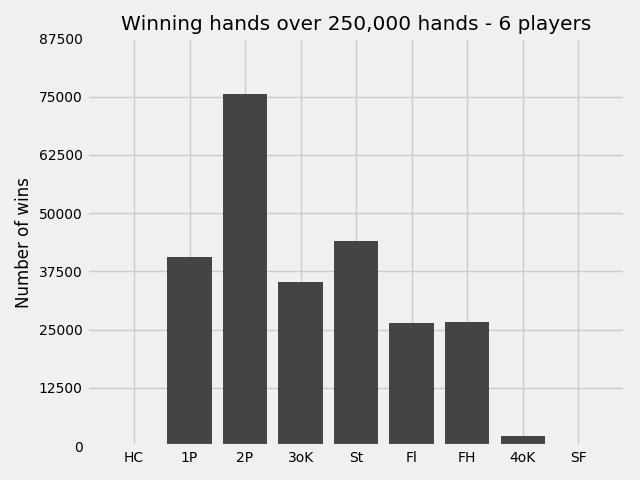

Terminal Poker
==============

A tool for analysis of long term poker strats.

## Beta Release

Players limp into the pot and check until the showdown...

Player decisions will be improved next release.

On the way to good decisions, this plot was made:

## Usage

**New usage --** you can also pump stdin into the program to affect number of rounds and number of players -- more on this later.

Begin by running make in the base directory.

Then run the executable poker with command line arguments specifying number of rounds to play, and whether you want a pretty output or output as a csv.

And example usage for N hands with csv formatted output is below:

    ./poker N 0

## to-do list

### Smart player decisions

In the current &beta; release, the players around the table limp into the pot and then check through until the showdown. We are looking
to create players who are able to make calculated based on the information available to them. The first step towards achieving this is 
collecting preliminary data regarding the value of each starting hand, as well as the probability of each hand landing.

### Data Collection

Collect the outcome of one million hands of poker so we can have accurate win percentages when choosing actions for each player.

The data we will process consists of the following items:

+ Pocket Cards,
+ Value of the winning hand.

From this we will produce an empirical histogram of hand values, used for counting our outs; win percentages of each pair of pocket cards, used when deciding whether you enter the pot.

